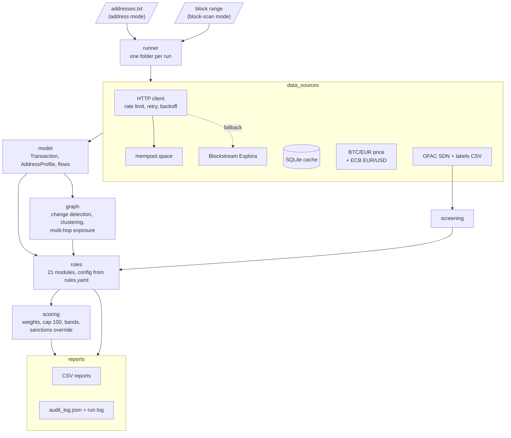

# btc-aml-monitor

[](https://github.com/edoardodaprato/btc-aml-monitor/actions/workflows/tests.yml)
[](LICENSE)


**Retrospective Bitcoin transaction monitoring for AML compliance**, built on free public data only.

🌐 **Project website: [edoardodaprato.github.io/btc-aml-monitor](https://edoardodaprato.github.io/btc-aml-monitor/)**

The tool screens Bitcoin addresses and block ranges against the OFAC SDN list and a set of
red-flag rules derived from the FATF *Red Flag Indicators of ML/TF on Virtual Assets* (2020)
and the EBA ML/TF Risk Factors Guidelines for crypto-asset service providers. Every alert is
explainable: it carries the rule that fired, its regulatory reference, the score contribution
and the transaction-level evidence.

> **Status: v1.0.0.** Feature-complete for its scope: address mode, block-scan mode, 21 rules,
> explainable scoring, CSV reports and audit trail. See the [CHANGELOG](CHANGELOG.md).

## The problem

Crypto-asset service providers (VASPs/CASPs) must monitor the on-chain history of the
addresses their customers interact with. Commercial blockchain-analytics tools solve this at
scale, but they are opaque and expensive. This project shows how the core logic works —
sanctions screening, exposure analysis, typology detection, risk scoring — in readable,
tested and fully configurable code.

## Features

- **Sanctions screening** against the official OFAC SDN list (532 Bitcoin addresses,
  65 entities at the time of writing), versioned by publish date and SHA-256.
- **Custom labels** (mixer, darknet market, ransomware, scam, exchange...) from a CSV where
  every label must cite its public source. No attribution is ever invented.
- **21 red-flag rules** mapped to FATF and EBA references, each with its AML rationale,
  configurable thresholds and weights.
- **Multi-hop exposure** in both directions (source and destination of funds), with
  pro-rata attribution, time ordering, decay per hop and hard limits on API usage.
- **Clustering and change detection** (common-input ownership, CoinJoin excluded).
- **Explainable 0–100 risk score**: every point is traced to a rule and its evidence;
  direct sanctions exposure always yields *Severe*.
- **EUR amounts** at the historical price of each transaction (mempool.space, with ECB
  EUR/USD reference rates to fill gaps); every price states its date and source.
- **Audit trail** per run: input hash, rule definitions and config hash, sanctions list
  version, data sources used, everything that could not be evaluated.
- **Zero cost, no node**: free public APIs (mempool.space, Blockstream fallback) with rate
  limiting, retries and a local SQLite cache.

## Quick start

```bash
python3 -m venv .venv
source .venv/bin/activate
pip install -e ".[dev]"
btc-aml show-config
btc-aml fetch-tx 7a86eb72b432ce2440aca3d8c71a4a5ec92645e4678ccb211c0ce41d882753ee
btc-aml update-ofac
btc-aml update-fx      # ECB EUR/USD rates, fill EUR price gaps
btc-aml screen 12aNKp2iDKuhEde2YfPdd4DFGenRUTKupL
btc-aml analyze 12aNKp2iDKuhEde2YfPdd4DFGenRUTKupL
btc-aml scan-addresses examples/demo_addresses.txt   # CSV reports + audit log in output/
btc-aml scan-blocks 733459                           # every transaction of a block
```

### Two modes

- **Address mode** (`scan-addresses`) starts from addresses you already care about
  (customers, counterparties) and scores each one 0–100 on its full history, with
  multi-hop exposure.
- **Block-scan mode** (`scan-blocks`) starts from the blockchain: it checks every
  transaction of up to 10 blocks with the rules that make sense on a single transaction
  (R01, R03, R04, R09, R14, R16, R19, R21) and clusters addresses across the block. It
  writes `blocks.csv`, `block_alerts.csv` and `addresses_for_review.txt`, a list of
  sanctioned or labelled addresses and their co-spenders ready for address mode.

A step-by-step user guide is available in [docs/GUIDE.md](docs/GUIDE.md).

## Example output

Real reports are in [`examples/`](examples) (third-party addresses redacted, see
[examples/README.md](examples/README.md)).

**Address mode** on [`examples/demo_addresses.txt`](examples/demo_addresses.txt):

```text
$ btc-aml scan-addresses examples/demo_addresses.txt
Run 20261009T223246Z: 3 analysed, 1 skipped
  100  Severe  12aNKp2iDKuhEde2YfPdd4DFGenRUTKupL
  100  Severe  1H939dom7i4WDLCKyGbXUp3fs9CSTNRzgL
   30  Medium  1A1zP1eP5QGefi2DMPTfTL5SLmv7DivfNa
  skipped this-is-not-an-address: line 11: not a valid Bitcoin address
```

| Address | Score | Why (`score_explanation`) |
|---|---|---|
| `12aNKp…TKupL` (OFAC: Behzad Mesri) | 100 Severe | R01 +100, R07 pass-through +20, R16 consolidation +10; sanctions override. Its cluster holds 2,578 addresses, the signature of a custodial service sweeping deposits |
| `1H939d…STNRzgL` (OFAC: listed under two individuals, programs CYBER2/IFSR/IRGC) | 100 Severe | R01 +100, R04 CoinJoin +25, R07 +20, R08 fan-in +15, R11 dormant reactivation +15, R16 +10, R21 anomalous fee +10 |
| `1A1zP1…DivfNa` (genesis block) | 30 Medium | R10 velocity, R15 dust, R16 consolidation: people still send "tribute" dust to Satoshi's address. A reminder that alerts need context |

An alert from [`alerts.csv`](examples/address_mode/alerts.csv):

```text
R11_DORMANT_REACTIVATION (medium, +15)
Inactive for 835 days (last activity 2019-07-17 02:45 UTC), then moved 0.50000000 BTC
(27,091 EUR) (in) on 2021-10-29 22:21 UTC; EUR threshold 10,000.
Ref: FATF (2020) Red Flag Indicators of ML/TF - Virtual Assets - transactions: patterns;
     EBA ML/TF Risk Factors Guidelines (...), Guideline 21 (CASPs)
```

**Block-scan mode** on block 733459 (25 April 2022, 1,189 transactions):

```text
$ btc-aml scan-blocks 733459
      2  R01_OFAC_DIRECT
      1  R04_COINJOIN
     60  R09_FAN_OUT
    106  R14_LARGE_TRANSACTION
     87  R16_CONSOLIDATION
      2  R19_CO_SPENDING_FLAGGED
  [SEVERE] block 733459 R01_OFAC_DIRECT: 3HqA7i3ttECLvgqvq69HNxxUP5BL7Z5YgA ([OFAC SDN]
  sanctioned: Alex Adrianus Martinus PEIJNENBURG ...) sends 0.12818828 BTC (4,765 EUR)
  [HIGH] block 733459 R19_CO_SPENDING_FLAGGED: 59 address(es) are clustered with
  3HqA7i3t... Cluster larger than 50 addresses: typical of a custodial service sweeping
  customer deposits ...
Addresses for review: 2 (+474 large-cluster members, commented out)
```

Two OFAC-listed addresses spend in this block, each swept together with dozens or hundreds
of other addresses: the pattern of an exchange collecting customer deposits. The structural
alerts (large transfers, batch payouts, consolidations) are mostly ordinary exchange and
mining-pool activity, which is why block scan produces leads, not scores.

## Architecture

Each stage has one job and is tested on its own. Rules never call the network directly:
they read a normalised model and a read-only chain interface.



| Folder | Content |
|---|---|
| [`src/btc_aml/data_sources`](src/btc_aml/data_sources) | API client, cache, prices, ECB rates, OFAC list, labels |
| [`src/btc_aml/model.py`](src/btc_aml/model.py) | Normalised transactions, flows, address profiles, alerts |
| [`src/btc_aml/graph`](src/btc_aml/graph) | Change detection, clustering, multi-hop exposure |
| [`src/btc_aml/rules`](src/btc_aml/rules) | One module per rule, registry and engine |
| [`src/btc_aml/scoring`](src/btc_aml/scoring) | Risk score and bands |
| [`src/btc_aml/block_scan.py`](src/btc_aml/block_scan.py) | Single-transaction checks for block-scan mode |
| [`src/btc_aml/reports`](src/btc_aml/reports) | CSV export and audit log |
| [`config`](config) | `settings.yaml` (sources, limits, bands) and `rules.yaml` (rules) |
| [`tests`](tests) | Offline tests with recorded API responses |

## Scoring

Each triggered rule contributes **once**: its weight times the strength of its strongest
alert (indirect exposure is weakened by the hop decay). Contributions are summed and capped
at 100, then mapped to a band: Low 0–24, Medium 25–49, High 50–74, Severe 75–100. Direct
sanctions exposure (R01) always forces *Severe*. The `score_explanation` column lists every
contribution, e.g. `R08_FAN_IN 15 + R10_HIGH_VELOCITY 10 + ...`.

## Red-flag rules

Every rule is a separate module in [`src/btc_aml/rules`](src/btc_aml/rules) with its AML
rationale in the docstring. Weights, severities and thresholds live in
[`config/rules.yaml`](config/rules.yaml).

| ID | Rule | What it detects | Reference |
|---|---|---|---|
| R01 | Direct sanctions exposure | Address on the OFAC SDN list, or direct transactions with one | OFAC SDN; FATF R.6; FATF RFI (source of funds) |
| R02 | Indirect sanctions exposure | Sanctioned funds within N hops (pro-rata, time-ordered), weight decayed per hop | OFAC SDN; FATF R.6; FATF RFI (source of funds) |
| R03 | High-risk category exposure | Direct or multi-hop exposure to addresses labelled mixer, darknet market, ransomware, scam | FATF RFI (source of funds, anonymity); EBA GL 21 |
| R04 | CoinJoin participation | Equal-output CoinJoins (Wasabi/JoinMarket-style) and Whirlpool 5x5 mixes | FATF RFI (anonymity); EBA GL 21 |
| R05 | Peel chain | Chain of transactions each paying out a small amount and forwarding the rest | FATF RFI (patterns) |
| R06 | Structuring | Repeated amounts just below 1,000 / 10,000 EUR in a short window | FATF RFI (size and frequency); TFR |
| R07 | Pass-through | Funds received and sent on within hours, balance back near zero | FATF RFI (patterns) |
| R08 | Fan-in | Many distinct senders within a short window | FATF RFI (patterns) |
| R09 | Fan-out | Many distinct recipients within a short window | FATF RFI (patterns) |
| R10 | High velocity | Transactions per day above threshold | FATF RFI (size and frequency) |
| R11 | Dormant reactivation | Significant movement after a long inactivity | FATF RFI (patterns) |
| R12 | New address, high volume | Large value in the first transactions of a new address | FATF RFI (patterns) |
| R13 | Round amounts | Repeated exact multiples of 0.1 / 1 BTC | FATF RFI (patterns) |
| R14 | Large transaction | Single transfer above 100,000 EUR (or 2 BTC when no price) | FATF RFI (size and frequency) |
| R15 | Dust | Tiny unsolicited amounts from many sources (dusting attack) | FATF RFI (patterns) |
| R16 | Consolidation | Many small inputs merged into one transaction | FATF RFI (patterns) |
| R17 | Address hopping | Funds moved quickly through fresh single-use addresses | FATF RFI (patterns) |
| R18 | Post-CoinJoin consolidation | Several CoinJoin outputs merged in one transaction | FATF RFI (anonymity) |
| R19 | Co-spending with flagged address | Inputs signed together with a sanctioned/high-risk address (common-input ownership) | OFAC SDN; FATF RFI (source of funds) |
| R20 | Round-trip | Funds returning to the address or its cluster within N hops | FATF RFI (patterns) |
| R21 | Anomalous fee | Fee rate far above the block median (urgency) | FATF RFI (patterns) |

*FATF RFI = FATF (2020) Red Flag Indicators of ML/TF – Virtual Assets. EBA GL 21 = EBA ML/TF
Risk Factors Guidelines, Guideline 21 (CASPs). TFR = Regulation (EU) 2023/1113. References
are given at section level and should be verified against the official texts.*

## Known limitations (vs commercial tools)

Commercial blockchain-analytics platforms (Chainalysis, Elliptic, TRM Labs...) differ from
this project in ways that matter for a real compliance decision:

- **Attribution.** Their value lies in millions of proprietary address labels (exchanges,
  services, illicit actors). Here, attribution is limited to the OFAC list and the labels
  you import yourself: an address with no listed link scores *Low* even if it belongs to a
  known illicit service.
- **Heuristics produce false positives.** Common-input clustering breaks with PayJoin and
  collaborative transactions, and merges customer deposits when an exchange sweeps them
  (block scan marks clusters above 50 addresses as likely custodial). Change detection is a
  guess. Fan-in, fan-out, consolidation and large transfers are everyday exchange and
  mining-pool activity. Alerts are leads to investigate, not conclusions.
- **Coverage limits.** At most 200 transactions per address, 20 counterparties per hop,
  3 hops and 10 minutes per address; block scan reads at most 10 blocks. Results state when
  a limit was hit (`history_truncated`, `exposure_complete`), but anything beyond it is unseen.
- **Bitcoin only, on-chain only.** No other chains, no Lightning, no cross-chain bridges,
  no off-chain exchange data, no Travel Rule messages.
- **Public APIs.** Free endpoints are rate-limited and slow (about a minute per full block,
  a few minutes per address with multi-hop exposure) and offer no service level.
- **Prices.** Historical BTC/EUR points can be up to 7 days old for older dates; the date
  and source are reported, and EUR thresholds fall back to BTC when no price exists.
- **CoinJoin detection** is structural (equal outputs, Whirlpool 5x5) and can miss newer
  protocols or flag batch payouts with equal amounts.
- **Regulatory references** are at section level and should be verified against the
  official texts; weights and thresholds are illustrative, not calibrated on real data.
- **Not a validated system**: no model validation, no case management, no four-eyes
  workflow, no alert tuning on a real customer base.

## Development

```bash
pytest           # offline tests: recorded API responses, never the network
ruff check .     # lint
ruff format .    # formatting
```

GitHub Actions runs lint and tests on Python 3.11 and 3.12 on every push, plus a guard that
fails if local data, outputs or secrets are ever tracked by git.

## Roadmap

- [x] Project skeleton, configuration, CI
- [x] SQLite cache
- [x] Esplora API client (mempool.space with automatic Blockstream fallback) and BTC/EUR prices
- [x] OFAC SDN list import and custom address labels
- [x] Single-address analysis
- [x] 21 red-flag rules
- [x] Explainable risk scoring (0–100, with sanctions override)
- [x] CSV reports and audit log
- [x] Multi-hop exposure, clustering and change detection
- [x] Block-range scanning
- [x] Portfolio polish: example outputs, architecture diagram, known limitations, v1.0.0

Possible next steps: HTML report per address, more chains (Ethereum), label import from
public datasets with provenance checks, alert tuning with a labelled sample.

## Disclaimer

This is an educational project. It is **not** a validated compliance solution and must not be
used as the sole basis for any compliance decision. It uses only public data and contains no
non-public information from any professional activity.

## License

[MIT](LICENSE) © 2026 Edoardo Daprato
